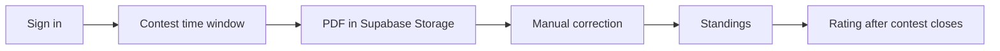

# Math Arena

Proof-based mathematics contests with authenticated PDF submissions, timed entry rules, manual grading and rating updates.

[Public preview](https://matharena-beta.vercel.app) · [Contest submission code](src/app/contests/%5Bid%5D/actions.ts) · [Rating calculation](src/lib/rating.ts)



## What it does

Math Arena models a written-proof competition: participants submit solution PDFs rather than selecting answers, and an administrator records scores before ratings are applied. The implementation includes both the participant flow and the correction workflow. The public landing page loads; a complete signed-in contest was not exercised during the 2026-09-19 audit.

## Technical highlights

- **Authentication and timing:** Supabase Auth identifies submitters; [server actions](src/app/contests/%5Bid%5D/actions.ts) check the official contest interval before upload.
- **File lifecycle:** uploads use contest/user/problem paths; a failed database insert removes the uploaded file. Downloads use signed URLs through the [submission layer](src/lib/submissions.ts).
- **Correction workflow:** [admin actions](src/app/admin/actions.ts) check administrator membership and store scores/status; standings aggregate each user's latest submission per problem.
- **Rating calculation:** [pairwise expected scores](src/lib/rating.ts) use an Elo-style logistic formula, averaged across opponents, with different K factors. Rating application checks that the contest ended, grading is complete and an update has not already been recorded.

## Current boundaries

The questions tab is explicitly a mock interface. Contest-room announcements are read from `src/lib/mock-data`; sample datasets are not evidence of real participation. Type-only imports from that folder are also used by real database-backed flows.

Supabase schema migrations and storage/RLS setup are not included in this repository. Database authorization, complete account/upload/correction flows and transactional rating updates have not been verified end to end. PDF acceptance checks the supplied MIME type or filename extension; it is not a content-security scan. This is an implementation in development, not a claim of a production-ready contest service.

## Verification

```bash
npm ci
npm run lint
npm run build
```

No automated test script is currently defined. These checks cover static quality and compilation, not live Supabase behavior.

## Development

Set `NEXT_PUBLIC_SUPABASE_URL` and `NEXT_PUBLIC_SUPABASE_ANON_KEY` in `.env.local`, configure the corresponding database and `contest-submissions` bucket, then run `npm run dev`. Required relations are visible in `src/lib` and the server actions; a reproducible migration/setup package remains to be added.
